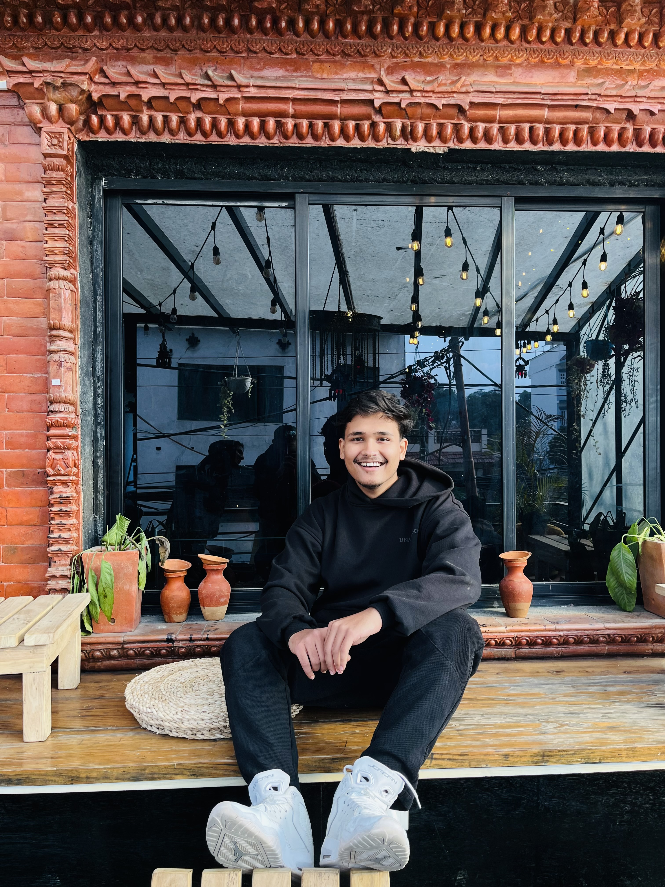

# 📸 Image Management Guide

## Quick Start - Download Placeholder Images

I've created two scripts to help you download placeholder images:

### Option 1: Using Python (Recommended)
```bash
python3 download-images.py
```

### Option 2: Using Bash
```bash
bash download-images.sh
```

Both scripts will download professional placeholder images to `assets/images/`

---

## 🖼️ Images Used in Portfolio

### Profile Images
- **profile.jpg** (500x500px)
  - Used in: Hero section, About section
  - Your main profile photo

### Project Images
- **project1.jpg** (800x600px) - Skin Disease Classification
- **project2.jpg** (800x600px) - Facial Recognition System
- **project3.jpg** (800x600px) - E-commerce Platform
- **project4.jpg** (800x600px) - Weather App

### Testimonial Avatars
- **avatar1.jpg** (100x100px) - John Anderson
- **avatar2.jpg** (100x100px) - Sarah Mitchell
- **avatar3.jpg** (100x100px) - Michael Chen

---

## 🔄 Using Your Own Images

### Method 1: Replace with Same Names
Simply copy your images to `assets/images/` with these exact names:
```bash
cp /path/to/your/photo.jpg assets/images/profile.jpg
cp /path/to/project1.png assets/images/project1.jpg
```

### Method 2: Use Different Names
If your images have different names, you can update them in `index.html`.

Find lines like:
```html

```

Change to:
```html

```

### Method 3: Keep Current Setup (Recommended)
The website now uses **online placeholder images as fallback**!

- If local images exist → uses local images
- If local images missing → automatically loads placeholder from Unsplash
- No broken images, ever! ✅

---

## 📏 Recommended Image Sizes

| Image Type | Size | Format | Notes |
|------------|------|--------|-------|
| Profile | 500x500px+ | JPG/PNG | Square, high quality |
| Projects | 800x600px+ | JPG/PNG | Landscape, clear screenshots |
| Avatars | 100x100px+ | JPG/PNG | Square headshots |

---

## 🎨 Image Optimization Tips

1. **Compress images** before uploading (use tinypng.com or squoosh.app)
2. **Use web-friendly formats**: JPG for photos, PNG for graphics
3. **Keep file sizes under 500KB** for fast loading
4. **Use descriptive filenames**: `safal-profile.jpg` instead of `IMG_1234.jpg`

---

## 🌐 Current Setup (Fallback Images)

Your website now automatically shows placeholder images if local images are missing:

✅ **Benefit**: Website looks great immediately
✅ **No Errors**: No broken image icons
✅ **Easy Replace**: Just add your images when ready

Replace placeholders whenever you're ready by adding your images to `assets/images/`

---

## 🚀 Next Steps

1. **Now**: Website works with placeholder images
2. **Later**: Run `python3 download-images.py` to get better placeholders
3. **When Ready**: Replace with your actual photos

Your portfolio is already live and looks great! 🎉
